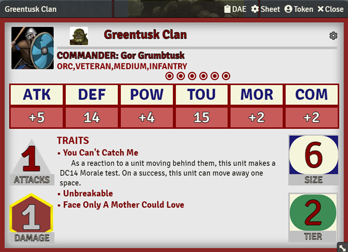
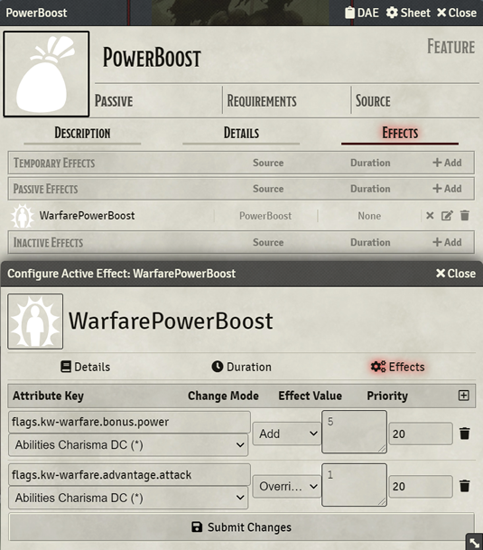
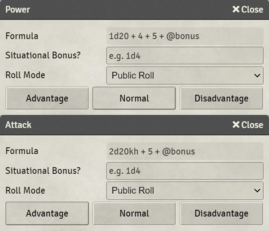

# K&W: Warfare

A [FoundryVTT](https://foundryvtt.com/) module that provides a unit sheet for MCDM's warfare system as seen in [Kingdoms & Warfare](https://shop.mcdmproductions.com/products/kingdoms-and-warfare-book).

**This project is not affiliated with MCDM and is in no way endorsed by them.**

The module adds a sheet for NPC Actors that designates them as a warfare unit and allows you to input any units created with the warfare system.

To use: Create an NPC actor and use the 'K&W Unit Sheet' sheet.

##Features:
* Drag-drop Traits, Experience, Equipment, Ancestry and Unit Type.
  * Dragging and dropping correctly marked features onto unit cards will correctly map it to the correct field (see How-to below)
  * Icons added by you for Ancestry and Unit Type features will be displayed on the unit card.
* Drag-drop Commander.
  * Dragging and dropping a PC or NPC actor onto unit cards will correctly map the actor as the commander of the unit
  * Players whose PCs are dropped onto the unit will set that player's permission for the unit to "Owner"
* Click on the rollable stats to trigger a roll.
* Unit HP is configured by the `Size` attribute so all normal methods to damage/heal tokens should function.
* Clickable Trait names that will expand the Trait details inside the sheet.
* Built-in Compendium with several helpful macros.
* Migration from the original Warfare module.
  * Simply change the sheet type to the new K&W Warfare NPC type and the data will be migrated to the new format
  * (NOTE: This is irreversible, and data no longer used by K&W Warfare like unit cost will be lost on migration)
* Support for the [Chat-Portrait](https://foundryvtt.com/packages/chat-portrait/) module for unit rolls.

##Proposed Features:
* Hook up targeting to automatically roll against matching stats (attack vs target's defense, etc...)
* Automatically apply damage on hit/successful power test (add option to disable)
* Store stats in the Feature items (Ancestry, Experience, etc...) and automatically calculate unit stats when added. This would enable drag/drop unit building from scratch.
* Add conditions for things like Weakened to mark units with.

**NOTE** Not all feature suggestions may be possible to implement in order to not infringe on MCDM's copyright.

##How to Use

###Drag-drop Experience, Equipment, Ancestry and Unit Type

1. Create an Item of the type "Feature"
2. Set the "Requirements" field to one of: `Experience`, `Equipment`, `Ancestry` or `Type`
*(any other value or blank will be treated as a unit Trait)*
3. (optional) Set the Item's icon. This only works for the `Ancestry` and `Type` traits.
4. Drag-drop the Item onto the K&W Warfare unit.

###Active Effects
Use traits or [DAE](https://foundryvtt.com/packages/dae) to add effects to the unit.

|Available flags|key|acceptable values|
|---|---|---|
|Roll Bonuses|`flags.kw-warfare.bonus`||
| |`flags.kw-warfare.bonus.attack`|any number|
| |`flags.kw-warfare.bonus.defense`|any number|
| |`flags.kw-warfare.bonus.morale`|any number|
| |`flags.kw-warfare.bonus.power`|any number|
| |`flags.kw-warfare.bonus.toughness`|any number|
|Advantage|`flags.kw-warfare.advantage`||
| |`flags.kw-warfare.advantage.attack`|0 for false, 1 for true|
| |`flags.kw-warfare.advantage.morale`|0 for false, 1 for true|
| |`flags.kw-warfare.advantage.power`|0 for false, 1 for true|
|Disadvantage|`flags.kw-warfare.disadvantage`||
| |`flags.kw-warfare.disadvantage.attack`|0 for false, 1 for true|
| |`flags.kw-warfare.disadvantage.morale`|0 for false, 1 for true|
| |`flags.kw-warfare.disadvantage.power`|0 for false, 1 for true|
|Diminishable|`flags.kw-warfare.special.diminishable`|0 for false, 1 for true|

A unit's size can also be modified using active effects by modifying the hp/max hp of the unit.

## License

This project is derived from the original [Warfare](https://bitbucket.org/Fyorl/warfare/src) module developed by Kim Mantas.

All additions and modifications to the source code are copyright 2021 Dylan Gulick and is released under the terms of the [GNU GPL v3](https://www.gnu.org/licenses/gpl-3.0.en.html). A copy of this license is available in the `LICENSE` file.

This program is free software: you can redistribute it and/or modify it under the terms of the GNU General Public License as published by the Free Software Foundation, either version 3 of the License, or (at your option) any later version.

This program is distributed in the hope that it will be useful, but WITHOUT ANY WARRANTY; without even the implied warranty of MERCHANTABILITY or FITNESS FOR A PARTICULAR PURPOSE. See the GNU General Public License for more details.
